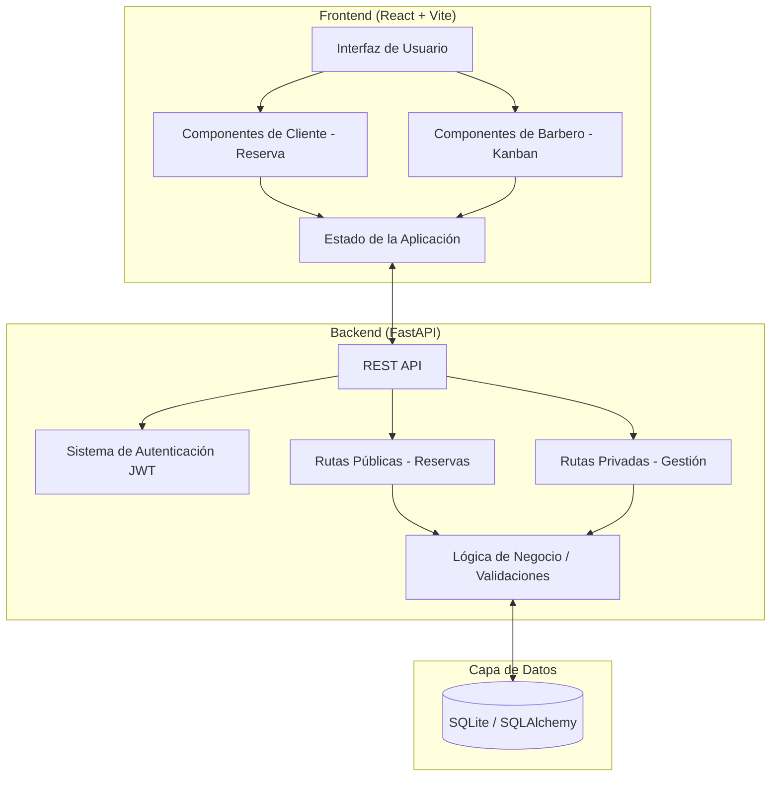

# Documentación del Sistema: Melion Barber

Esta documentación proporciona una visión general del sistema de gestión de turnos para la barbería "Melion Barber", detallando las historias de usuario y el diseño arquitectónico del software.

## 👥 Historias de Usuario

El sistema está dividido en dos grandes áreas: el Portal Público para clientes y el Dashboard de Gestión para el barbero.

### Para el Cliente (Portal de Reservas)
- [x] **Selección de Servicio**:
   - *Como cliente*, quiero ver una lista detallada de los servicios (corte, barba, etc.) con sus precios y descripciones para elegir el que deseo.
- [x] **Reserva de Turno**:
   - *Como cliente*, quiero seleccionar una fecha en un calendario y ver los horarios disponibles para ese día, asegurándome de que no haya solapamientos.
- [x] **Identificación**:
   - *Como cliente*, quiero ingresar mi nombre y teléfono (con validación automática) para que el barbero pueda contactarme y confirmar mi cita.
- [x] **Confirmación**:
   - *Como cliente*, quiero recibir una confirmación visual de que mi turno ha sido agendado exitosamente.

### Para el Barbero (Administración)
- [x] **Gestión de Agenda (Kanban)**:
   - *Como barbero*, quiero visualizar mis turnos en un tablero organizado por estados (Pendiente, Confirmado, Completado, Cancelado) para gestionar el flujo de trabajo diario.
- [x] **Control de Estados**:
   - *Como barbero*, quiero poder cambiar el estado de un turno fácilmente para reflejar el progreso del servicio.
- [x] **Configuración de Disponibilidad**:
   - *Como barbero*, quiero definir mis días laborales y rangos horarios para que el sistema solo permita reservas en mis horas de trabajo.
- [x] **Seguridad**:
   - *Como barbero*, quiero acceder al dashboard mediante un login seguro para proteger la información de mis clientes y mi agenda.
- [x] **Edición Manual**:
   - *Como barbero*, quiero tener la capacidad de modificar o cancelar cualquier turno manualmente en caso de imprevistos.

---

## 🏗️ Diseño del Sistema

El sistema sigue una arquitectura de **Cliente-Servidor** moderna, separando la interfaz de usuario de la lógica de negocio y persistencia.

### Componentes Clave:
- **Frontend**: Una Single Page Application (SPA) responsiva que utiliza Tailwind CSS para una estética premium y DnD Kit para la interactividad del tablero Kanban.
- **Backend**: Un servidor de alto rendimiento con FastAPI que maneja la validación de datos mediante Pydantic y la comunicación con la base de datos.
- **Base de Datos**: SQLite para una persistencia ligera y eficiente, gestionada a través del ORM SQLAlchemy.

---

## 🛠️ Stack Tecnológico

| Capa | Tecnologías |
| :--- | :--- |
| **Frontend** | React, TypeScript, Vite, Tailwind CSS, Lucide Icons, DnD Kit |
| **Backend** | Python, FastAPI, Pydantic, JWT Auth |
| **Persistencia** | SQLite, SQLAlchemy |
| **Despliegue** | Uvicorn (Servidor ASGI) |
